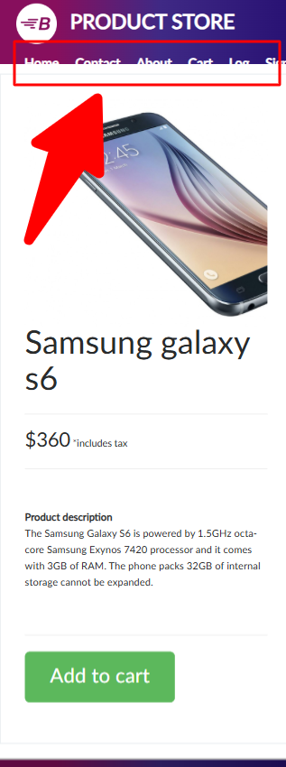

# Bug Reports

The following bug report samples were created as part of hands-on testing projects and QA exercises.

---

**Summary:**
Menu bar not responsive on product page

**Priority & Severity:**
P3 - Low

**Description:**
On the product page the menu bar fails to display properly when viewed on mobile devices or in responsive mode. The layout overlaps and it fails to appear entirely.

**Steps to reproduce:**

1. Go to Product Page https://www.demoblaze.com/prod.html?idp_=1 

2. Resize the browser window to a mobile or tablet size

**Expected result:**
The menu bar should adjust its layout to fit the screen size properly.

**Actual result:**
The menu bar is overlapping or cut off when viewed on smaller devices (mobile/tablet).

**Attachments:**

---

**Summary:** 
About us page video fails to load

**Priority & Severity:**
P6 - Low

**Description:**
On the "About us" page, the video doesn't load. Instead of the video, an error message appears on the screen.

**Steps to reproduce:**

1. Go to https://www.demoblaze.com/index.html 

2. Click on “About us”

**Expected result:**
The video should load and play automatically or be ready for the user to click play.

**Actual result:**
The following error message is displayed:
*"The media could not be loaded, either because the server or network failed or because the format is not supported."*

The video doesn’t load. 

**Attachements:**

