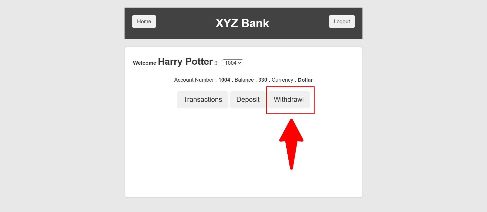
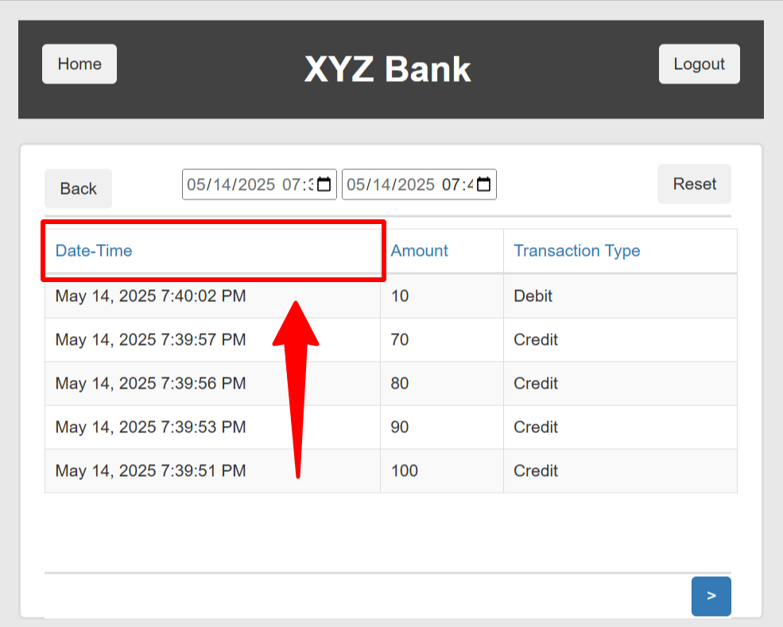

# Bug Reports

The following bug report samples were created as part of hands-on testing projects and QA exercises.

---

**Summary:**
Responsive issue: Menu bar layout overlaps on small viewports (Product Page) 

**Priority & Severity:**
P3 - Low

**Description:**
On the Product Page, the menu bar fails to display correctly on mobile devices and in responsive mode. The layout overlaps and some menu elements do not appear properly.

**Steps to reproduce:**

1. Go to Product Page https://www.demoblaze.com/prod.html?idp_=1 

2. Resize the browser window to a mobile or tablet viewport size

**Expected result:**

:white_check_mark: The menu bar should responsively adjust to the screen size, displaying all elements clearly without overlapping.

**Actual result:**
:x: The menu bar overlaps and some parts are cut off or missing on smaller screen sizes (mobile/tablet). 

**Attachments:**

---

**Summary:** 
About us page video fails to load

**Priority & Severity:**
P6 - Low

**Description:**
On the "About us" page, the video doesn't load. Instead of the video, an error message appears on the screen.

**Steps to reproduce:**

1. Go to https://www.demoblaze.com/index.html 

2. Click on “About us”

**Expected result:**
:white_check_mark: The video should load and play automatically or be ready for the user to click play.

**Actual result:**
:x: The following error message is displayed:
*"The media could not be loaded, either because the server or network failed or because the format is not supported."*

The video doesn’t load. 

**Attachments:**

---

**Summary:**
Typo in withdrawal tab label

**Priority & Severity:**
P6 - Low

**Description:**
There is a spelling mistake in the transaction tab. The word "Withdrawl" is incorrectly written. The correct spelling is "Withdrawal".

**Steps to reproduce:**

1. Go to https://www.globalsqa.com/angularJs-protractor/BankingProject/#/login  

2. Click on “Customer Login” button

3. Select name “Harry Potter”

4. Click on “Login” button

**Expected result:**
:white_check_mark: The tab should be labeled “Withdrawal”, which is the correct spelling.

**Actual result:**
:x: The tab is labeled “Withdrawl”, which is a typo.

**Attachments:**

---

**Summary:**
Missing sort indicator in Date-Time column

**Priority & Severity:**
P6 - Low

**Description:**
When clicking the “Date-Time” column in the Transactions section, the data gets sorted in ascending or descending order. However, there is no visual indicator to show the current sort direction, which might confuse users.

**Steps to reproduce:**

1. Go to https://www.globalsqa.com/angularJs-protractor/BankingProject/#/login 

2. Click on the “Customer Login” button

3. Select “Harry Potter” name

4. Click on the “Login” button

5. Click on the “Transactions” button

6. Click on the “Date-Time” column header

**Expected result:**
:white_check_mark: The table should display an arrow icon to indicate the sort order after clicking the “Date-Time” column header.

**Actual result:**
:x: The table sorts the data, but no arrow or any indicator appears to show sorting direction.

**Attachments:**

---

**Summary:**
Flag icon redirects to Info Turism instead of translating website

**Priority & Severity:**
P6 - Low

**Description:**
Clicking the flag icon to switch language redirects the user to the “Info Turism” section instead of translating the entire website content into the selected language.

**Steps to reproduce:**

1. Go to: https://www.primariatechirghiol.ro/ 

2. Click on the flag icon to switch the language

**Expected result:**
:white_check_mark: Clicking the flag icon should translate the entire website's content to the selected language, not redirect to a specific section.

**Actual result:**
:x: Clicking the flag icon redirects to the “Info Turism” section without changing the website language.

