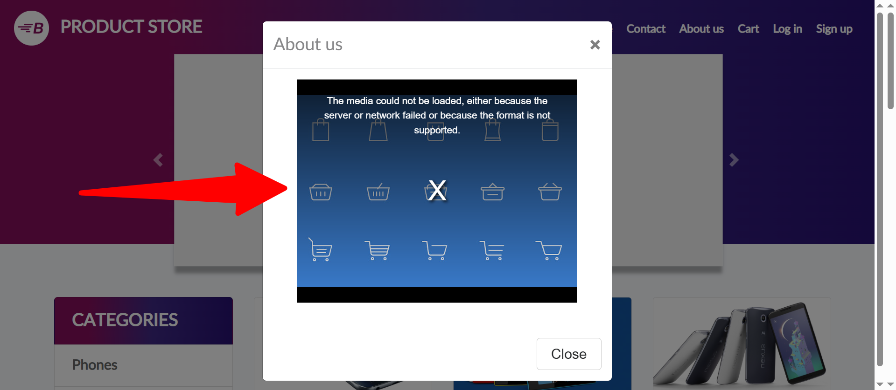

# Bug Reports

The following bug report samples were created as part of hands-on testing projects and QA exercises.

---

**Summary:**
Responsive issue: Menu bar layout overlaps on small viewports (Product Page) 

**Priority & Severity:**
P3 - Low

**Description:**
On the Product Page, the menu bar fails to display correctly on mobile devices and in responsive mode. The layout overlaps and some menu elements do not appear properly.

**Steps to reproduce:**

1. Go to Product Page https://www.demoblaze.com/prod.html?idp_=1 

2. Resize the browser window to a mobile or tablet viewport size

**Expected result:**
The menu bar should responsively adjust to the screen size, displaying all elements clearly without overlapping.

**Actual result:**
The menu bar overlaps and some parts are cut off or missing on smaller screen sizes (mobile/tablet). 

**Attachments:**

---

**Summary:** 
About us page video fails to load

**Priority & Severity:**
P6 - Low

**Description:**
On the "About us" page, the video doesn't load. Instead of the video, an error message appears on the screen.

**Steps to reproduce:**

1. Go to https://www.demoblaze.com/index.html 

2. Click on “About us”

**Expected result:**
The video should load and play automatically or be ready for the user to click play.

**Actual result:**
The following error message is displayed:
*"The media could not be loaded, either because the server or network failed or because the format is not supported."*

The video doesn’t load. 

**Attachements:**

